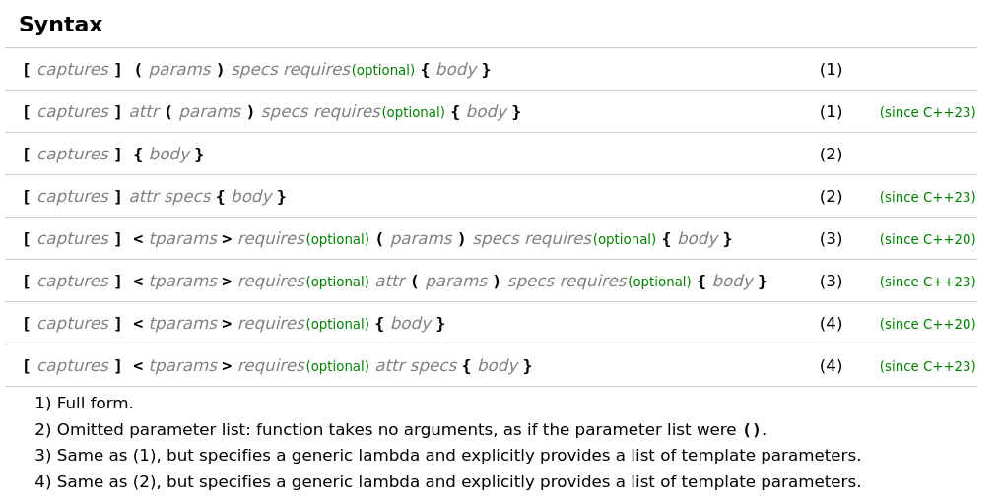

# Advanced C++ Course

<!-- _paginate: skip  -->
<!-- _class: titlecover -->
<!-- _footer: "" -->

### Lambdas and other functional utilities

#### CSCS

---

# Overview

- Not just functions: C++ has many other utilities for dealing with things that
  behave like a function
- Quick tour of lambdas, `operator()`, `std::function`, `std::bind`,
  `std::apply`

---

# Lambda use case 1: algorithms with higher-order functions

- Sometimes functions take another function as a parameter: "higher order function"
- Treating functions as data
- Example: `transform` takes a range as input and modifies the elements with a function
- What can we use in place of `???`

```c++
std::vector<int> x{1, 4, 7, 1, 4};
std::ranges::transform(x, ???);
```

---

# Lambda use case 1: algorithms with higher-order functions

- Sometimes functions take another function as a parameter: "higher order function"
- Treating functions as data
- Example: `transform` takes a range as input and modifies the elements with a function
- We can pass regular functions into `transform`

```c++
int triple(int x) { return 3 * x; }

std::vector<int> x{1, 4, 7, 1, 4};
std::ranges::transform(x, triple);
```

---

# Lambda use case 1: algorithms with higher-order functions

- Sometimes functions take another function as a parameter: "higher order function"
- Treating functions as data
- Example: `transform` takes a range as input and modifies the elements with a function
- We can also use _lambdas_: "function literals"

```c++
std::vector<int> x{1, 4, 7, 1, 4};
std::ranges::transform(x, [](int x) { return 3 * x; });
```

---

# Lambda use case 1: algorithms with higher-order functions

- Sometimes functions take another function as a parameter: "higher order function"
- Treating functions as data
- Example: `transform` takes a range as input and modifies the elements with a function
- Lambdas can also be assigned to variables, but we don't know their type

```c++
std::vector<int> x{1, 4, 7, 1, 4};
auto triple = [](int x) { return 3 * x; };
std::ranges::transform(x, triple);
```

---

# Lambda use case 2: adding state

- Sometimes we want to use variables from outside the lambda/function
- Example: `partition` partitions an input range into two parts based on a predicate
- We can again use functions or lambdas in place of `???`

```c++
std::vector<int> x{1, 4, 7, 1, 4};
// partition vector into even and odd
std::ranges::partition(x, ???);
```

---

# Lambda use case 2: adding state

- Sometimes we want to use variables from outside the lambda/function
- Example: `partition` partitions an input range into two parts based on a predicate
- We can again use functions or lambdas in place of `???`

```c++
bool even(int x) { return x % 2 == 0; }

std::vector<int> x{1, 4, 7, 1, 4};
// partition vector into even and odd
std::ranges::partition(x, even);
```

---

# Lambda use case 2: adding state

- Sometimes we want to use variables from outside the lambda/function
- Example: `partition` partitions an input range into two parts based on a predicate
- We can again use functions or lambdas in place of `???`

```c++
std::vector<int> x{1, 4, 7, 1, 4};
// partition vector into even and odd
auto even = [](int x) { return x % 2 == 0; };
std::ranges::partition(x, even);
```

---

# Lambda use case 2: adding state

- Sometimes we want to use variables from outside the lambda/function
- Example: `partition` partitions an input range into two parts based on a predicate
- How do we use `pivot` in `pred`?

```c++
std::vector<int> x{1, 4, 7, 1, 4};
int pivot = get_pivot(v);
// partition vector into bigger and smaller than pivot
auto pred = [](int x) { return x > pivot; }; // Does not compile!
std::ranges::partition(x, pred);
```

---

# Lambda use case 2: adding state

- Sometimes we want to use variables from outside the lambda/function
- Example: `partition` partitions an input range into two parts based on a predicate
- `[]` allows "capturing" variables from outer scope
  - Lambdas also sometimes called "closures", because they "close over" the
    environment where they are defined

```c++
std::vector<int> x{1, 4, 7, 1, 4};
int pivot = get_pivot(v);
// partition vector into bigger and smaller than pivot
auto pred = [pivot](int x) { return x > pivot; };
std::ranges::partition(x, pred);
```

---

# Lambda use case 3: C++ overloads and function templates

- Sometimes we want to pass not only one function to another function, but a
  whole "overload set", i.e. multiple functions with the same name
- Example: print in another thread with `std::async`

```c++
void print(double);
void print(struct important_data);
template <typename T>
void print(T);

std::vector<int> v{1, 2, 3, 4};
auto all_prints = &print; // Does not work!
auto one_print = &print<int>; // Ok, but only one function
auto f = std::async(all_prints, v);
```

---

# Lambda use case 3: C++ overloads and function templates

- Sometimes we want to pass not only one function to another function, but a
  whole "overload set", i.e. multiple functions with the same name
- Example: print in another thread with `std::async`
- Can only take the address of one specific overload
- Lambdas can help us delay the choice of overload
    - Advanced: sometimes abstracted away as a macro
      (https://github.com/rollbear/lift/blob/3927d06415f930956341afd5bc223f912042d7e4/include/lift.hpp#L20-L29)

```c++
void print(double);
void print(struct important_data);
template <typename T>
void print(T);

std::vector<int> v{1, 2, 3, 4};
auto all_prints = [](auto x) { print(x); };
auto f = std::async(all_prints, v);
```

---

# Lambdas, formally



---

# Lambdas, formally

- Lambdas are syntax sugar over structs with `operator()`, i.e. the call operator
- The following are equivalent, except we don't know the type of `real_lambda`

```c++
struct my_lambda {
   int x;
   
   int operator()(int y) const { return x * y; }
}

int x = 42;
auto emulated_lambda = my_lambda{x};
auto real_lambda = [x](int y) { return x * y; };
```

---

# Lambdas, formally

- Captures can be implicit or explicit, by value or by reference
- Capture `x` explicitly by reference

```c++
struct my_lambda {
   int& x;
   
   int operator()(int y) const { return x * y; }
}

int x = 42;
auto emulated_lambda = my_lambda{x};
auto real_lambda = [&x](int y) { return x * y; };
```

---

# Lambdas, formally

- Captures can be implicit or explicit, by value or by reference
- Capture `x` implicitly by reference, `z` explicitly by value

```c++
struct my_lambda {
   int& x;
   int z;
   
   int operator()(int y) const { return x * y * z; }
}

int x = 42;
int z = 3;
auto emulated_lambda = my_lambda{x, z};
auto real_lambda = [&, z](int y) { return x * y * z; };
```

---

# Lambdas, formally

- Captures can be implicit or explicit, by value or by reference
- Capture `x` explicitly by reference, `z` implicitly by value

```c++
struct my_lambda {
   int& x;
   int z;
   
   int operator()(int y) const { return x * y * z; }
}

int x = 42;
int z = 3;
auto emulated_lambda = my_lambda{x, z};
auto real_lambda = [=, &x](int y) { return x * y * z; };
```

---

# Lambdas, formally

- Captures can be implicit or explicit, by value or by reference
- Capture `this` by value or reference

```c++
class my_class {
   std::tuple<int, int> t;

   auto g() {
      // *this copied into lambda capture
      auto t = std::thread([*this])(){ /* ... */ });
      t.detach();
   }

   auto f() {
      // this is a pointer, beware dangling pointer access!
      auto t = std::jthread([this]() { /* ... */ });
      t.detach();
   }
};
```

---

# Lambdas, formally

- Captures can be given new names inside the lambda body with initializer syntax
- Can capture by value and by reference also with initializers

```c++
void g(std::tuple<int, int>&& t);
void g(std::tuple<int, int> const& t);

void f(std::tuple<int, int>&& t1) {
    std::jthread([t2 = std::move(t1)]() /* mutable */ {
        // Beware t2 is not actually moved unless the lambda is marked mutable!
        // t2 is const, std::move(t2) is const&&
        g(std::move(t2));
    })
}
```

---

# `std::function` use case: API boundary with `std::function`

- Not everything needs to be templated etc. for optimal performance
- A usable API may be more important
- Example: register a function to be called at startup of a library
- We can use function pointers

```c++
void register_startup_handler(void(*)(const configuration&));
void print_config(const configuration&);

register_startup_handler(print_config);
```

---

# `std::function` use case: API boundary with `std::function`

- Not everything needs to be templated etc. for optimal performance
- A usable API may be more important
- Example: register a function to be called at startup of a library
- We can use function pointers, but lambdas are not function pointers (most of
  the time: https://godbolt.org/z/Wb6xx6Kz1)

```c++
void register_startup_handler(void(*)(const configuration&));

auto print_config = [](const configuration&) { /* do stuff */ };
register_startup_handler(print_config);
```

---

# `std::function` use case: API boundary with `std::function`

- Not everything needs to be templated etc. for optimal performance
- A usable API may be more important
- Example: register a function to be called at startup of a library
- We can use function pointers, but lambdas are not function pointers (most of
  the time: https://godbolt.org/z/Wb6xx6Kz1)

```c++
void register_startup_handler(void(*)(const configuration&));

int x = 42;
auto print_config = [x](const configuration&) { /* do stuff with x as well */ };
register_startup_handler(print_config); // Does not work!
```

---

# `std::function` use case: API boundary with `std::function`

- Not everything needs to be templated etc. for optimal performance 
- A usable API may be more important
- Example: register a function to be called at startup of a library
- We can template, but not necessary in this case

```c++
template <typename F>
void register_startup_handler(F&&);

int x = 42;
auto print_config = [x](const configuration&) { /* do stuff with x as well */ };
register_startup_handler(print_config);
```

---

# `std::function` use case: API boundary with `std::function`

- Not everything needs to be templated etc. for optimal performance 
- A usable API may be more important
- Example: register a function to be called at startup of a library
- `std::function`: type-erased callable wrapper
  - Takes function anything that looks like it could be callable with the right signature

```c++
void register_startup_handler(std::function<void(const configuration&)>);

int x = 42;
auto print_config = [x](const configuration&) { /* do stuff with x as well */ };
register_startup_handler(print_config);
```

---

# `std::function`, formally

- Type-erased callable wrapper
- Type-erasure implies heap-allocation and virtual functions and in turn some overhead
- Will not be inlined
- Can hide implementation in source file

---

# Other useful functional utilities

---

# `std::bind_front`: "hard-code" the first arguments of a function

```c++
int f(double, std::string);

int x = 42;
std::string y = "hello";

// bind_front with only a function is a no-op
std::bind_front(f)(x, y);

// bind_front reduces the arity of the function by the
// number of (non-function) arguments passed to bind_front
std::bind_front(f, x)(y);
std::bind_front(f, x, y)();
```

`std::bind` also exists, but prefer lambdas or `std::bind_front` whenever
possible; `std::bind` has hairy corner cases that make it error-prone:
https://godbolt.org/z/xPE6fa1K9

---

# `std::apply`: unpack a tuple into separate arguments

- similar to unpacking with `*` in Python

```c++
int f(double, std::string);

std::tuple<int, std::string> t{42, "hello"};
std::string y = "hello";

std::apply(f, t);
```

---

# `std::(c)ref`: obtain a copyable (const) reference to an object

- value semantics like pointers, can be rebound
- non-nullable like references
- `std::(c)ref` are functions which return `std::reference_wrapper<T>`
- can opt-in to references in places that normally don't allow references

```c++
int f(double&, std::string);

int x = 42;
std::string y = "hello";

std::bind_front(f, std::ref(x))(y);
```

---

# Lambda hack: Immediately invoked function/lambda expression

- Can (ab)use lambdas for complex initialization
- Ternary operator has no equivalent with `if-else`

```c++
auto x = pred() ? y : z;
```

---

# Lambda hack: Immediately invoked function/lambda expression

- Can (ab)use lambdas for complex initialization
- Can't return only from a scope, only from the whole function

```c++
auto x = if (pred()) {
    ??? y; // nothing we can do here
} else {
    ??? z; // nothing we can do here
}
```

---

# Lambda hack: Immediately invoked function/lambda expression

- Can (ab)use lambdas for complex initialization
- Can default initialize and then assign

```c++
// We have to know the type of x
T x;
if (pred()) {
    x = y;
} else {
    x = z;
}
```

---

# Lambda hack: Immediately invoked function/lambda expression

- Can (ab)use lambdas for complex initialization
- We can return from a lambda without returning from the outer function!

```c++
// We can also make x const
const auto x = [&]() {
    if (pred()) {
        return y; // return from lambda, not from outer scope!
    } else {
        return z; // return from lambda, not from outer scope!
    }
}();
```

---

# Enjoy your break: What does this do?

- https://quuxplusone.github.io/blog/2018/05/17/super-elider-round-2/
- https://akrzemi1.wordpress.com/2018/05/16/rvalues-redefined/
- https://godbolt.org/z/5fxP3EYnn

```c++
template <typename F>
class foo
{
    F&& f;

public:
    explicit foo(F&& f) : f(std::forward<F>(f)) {}

    using type = decltype(std::declval<F&&>()());
    operator type() { return std::forward<F>(f)(); }
};
```
