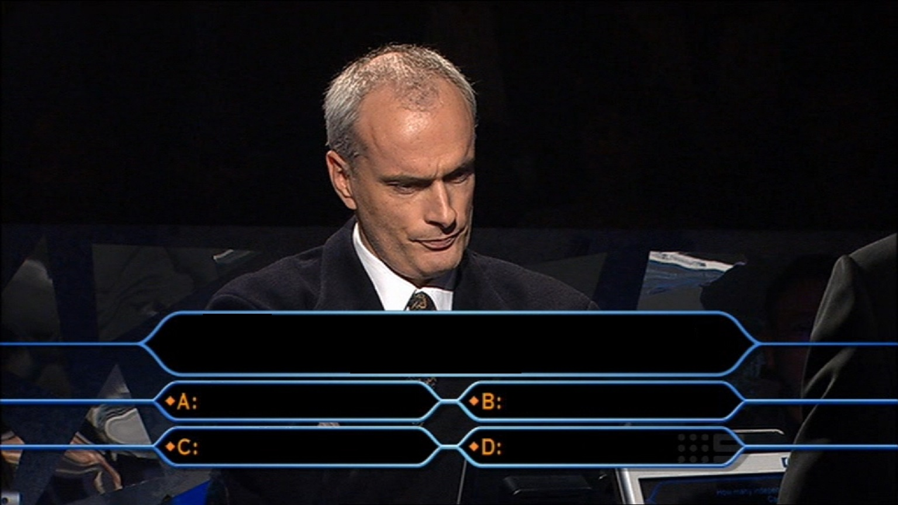

<!-- _class: lead -->
# Why do we need generic programming?

---
<div class="hcenter">

# Strong Typing

<center>

C++ is a strongly typed language.

</center>

This means that each variable is assigned a type at definition, and it cannot change over time.

This gives a lot of safety, plus it allows the language(=compiler) to do assumptions and optimize the code.

</div>

---
# 💪 Strong typing vs 🦆 duck typing?

<div class="hcenter">

<!-- https://godbolt.org/z/41KdEd333 -->

```python
class Person:
    def feed(self, food):
        print(f"lets eat some {food}")

class Chimney:
    def feed(self, fuel):
        print(f"let's burn some {fuel}")

def feed_all(storage, obj):
    for element in storage:
        obj.feed(element)

storage_basement = ["🪵", "⛽️"]
storage_1st_floor = ["🍝", "🍗", "🧁",]

print("not a big problem... 🗑️")
feed_all(storage_1st_floor, Chimney())

print("unless you start eating it! 💀")
feed_all(storage_basement, Person())
```

```
not a big problem... 🗑️
let's burn some 🍝
let's burn some 🍗
let's burn some 🧁
unless you start eating it! 💀
lets eat some 🪵
lets eat some ⛽️
```

<!--
```cpp
template <class T, class U>
void enroll(T x, U y) {
    x.feed(y);
}

enroll(Student(), CppAdvancedCourse());
enroll(Customer(), PremiumProgram());
```
-->

</div>

---
<!-- _class: lead -->

# It's better safe than sorry

---
<!-- _class: lead -->

# It's better **type**safe than sorry
(cit)

---
<!-- _class: lead -->
<div class="hcenter">

Yeah, but having to write a function/class for every single type (and combination) does not scale...

```cpp
int subtract(unsigned int a, unsigned int b);
int subtract(int a, int b);
int subtract(int a, unsigned int b);
float subtract(float a, float b);
```

<center>

**Oh! That's why we need generic programming!**

</center>

</div>

---
<center>

# C++ GENERIC PROGRAMMING = TEMPLATE!

</center>

<div class="hcenter">

```cpp
template <class T>
T add(T a, T B) {
    return a + b;
}

auto add(auto a, auto B) {
    return a + b;
}
```

</div>

We can have template specialization for different types and combinations, but the template "placeholder" accepts anything.

If at template instantiation time, it addresses a problem with the given type (e.g. we call a functon that this type does not have), it would complain with a build error 💥.

<mark>Basic template generic programming sounds a bit like "duck typing", but at compile time.</mark>

It's slightly better, but in C++ we are not satisfied with sub-optimal solutions...we want the best! 😁

--- 
# SFINAE

<div class="hcenter">

**SFINAE** allows to disable/enable some overloads at certain conditions.


```cpp
template <class T,
    std::enable_if_t<
            std::is_integral_v<T>
            || std::is_integral_v<T>,
            int> = 0>
void add(T a, T b) {
    return a + b;
}
```

With **SFINAE** we have a finer control on the overload set, in practice **it enables constraining template**! 

<center>

**Exactly what we wanted!**

</center>

</div>

---
<div class="hcenter">

# SFINAE is powerful and is supported by STL

Actually, SFINAE allows us to do many things in a quite rigorous way.

SFINAE is supported by the STL with:

- `std::enable_if`
it can be used in many ways to enable or disable a specialization (class, function, ...)
- `#include <type_traits>`
it provides some common and useful requirements and transformers for types

</div>

---
# SFINAE errors

<div class="hcenter">

It's nice that we can figure out at compile time about errors instead of facing them at runtime...we like it!

It means less error in production, safer code. Nice! 🤩

```cpp
#include <vector>
#include <algorithm>

struct Number {
    long long value_;
};

int main() {
    std::vector<int> integers;
    std::sort(integers.begin(), integers.end());

    std::vector<Number> numbers;
    std::sort(numbers.begin(), numbers.end());
}
```

There's an error in the code above... 🧐

</div>

---
<style scoped>
pre { 
    color: white;
    white-space: pre-wrap;
    font-size: 5pt;
}
</style>

# GCC 13.2 - 79 lines of output

<!-- https://godbolt.org/z/34nq5K3rK -->

<pre style="color: black;">
In file included from /opt/compiler-explorer/gcc-13.2.0/include/c++/13.2.0/bits/stl_algobase.h:71,
                 from /opt/compiler-explorer/gcc-13.2.0/include/c++/13.2.0/vector:62,
                 from <source>:1:
/opt/compiler-explorer/gcc-13.2.0/include/c++/13.2.0/bits/predefined_ops.h: In instantiation of 'constexpr bool __gnu_cxx::__ops::_Iter_less_iter::operator()(_Iterator1, _Iterator2) const [with _Iterator1 = __gnu_cxx::__normal_iterator<Number*, std::vector<Number> >; _Iterator2 = __gnu_cxx::__normal_iterator<Number*, std::vector<Number> >]':
/opt/compiler-explorer/gcc-13.2.0/include/c++/13.2.0/bits/stl_algo.h:1819:14:   required from 'void std::__insertion_sort(_RandomAccessIterator, _RandomAccessIterator, _Compare) [with _RandomAccessIterator = __gnu_cxx::__normal_iterator<Number*, vector<Number> >; _Compare = __gnu_cxx::__ops::_Iter_less_iter]'
/opt/compiler-explorer/gcc-13.2.0/include/c++/13.2.0/bits/stl_algo.h:1859:25:   required from 'void std::__final_insertion_sort(_RandomAccessIterator, _RandomAccessIterator, _Compare) [with _RandomAccessIterator = __gnu_cxx::__normal_iterator<Number*, vector<Number> >; _Compare = __gnu_cxx::__ops::_Iter_less_iter]'
/opt/compiler-explorer/gcc-13.2.0/include/c++/13.2.0/bits/stl_algo.h:1950:31:   required from 'void std::__sort(_RandomAccessIterator, _RandomAccessIterator, _Compare) [with _RandomAccessIterator = __gnu_cxx::__normal_iterator<Number*, vector<Number> >; _Compare = __gnu_cxx::__ops::_Iter_less_iter]'
/opt/compiler-explorer/gcc-13.2.0/include/c++/13.2.0/bits/stl_algo.h:4861:18:   required from 'void std::sort(_RAIter, _RAIter) [with _RAIter = __gnu_cxx::__normal_iterator<Number*, vector<Number> >]'
<source>:13:14:   required from here
/opt/compiler-explorer/gcc-13.2.0/include/c++/13.2.0/bits/predefined_ops.h:45:23: error: no match for 'operator<' (operand types are 'Number' and 'Number')
   45 |       { return *__it1 < *__it2; }
      |                ~~~~~~~^~~~~~~~
In file included from /opt/compiler-explorer/gcc-13.2.0/include/c++/13.2.0/bits/stl_algobase.h:67:
/opt/compiler-explorer/gcc-13.2.0/include/c++/13.2.0/bits/stl_iterator.h:1250:5: note: candidate: 'template<class _IteratorL, class _IteratorR, class _Container> bool __gnu_cxx::operator<(const __normal_iterator<_IteratorL, _Container>&, const __normal_iterator<_IteratorR, _Container>&)'
 1250 |     operator<(const __normal_iterator<_IteratorL, _Container>& __lhs,
      |     ^~~~~~~~
/opt/compiler-explorer/gcc-13.2.0/include/c++/13.2.0/bits/stl_iterator.h:1250:5: note:   template argument deduction/substitution failed:
/opt/compiler-explorer/gcc-13.2.0/include/c++/13.2.0/bits/predefined_ops.h:45:23: note:   'Number' is not derived from 'const __gnu_cxx::__normal_iterator<_IteratorL, _Container>'
   45 |       { return *__it1 < *__it2; }
      |                ~~~~~~~^~~~~~~~
/opt/compiler-explorer/gcc-13.2.0/include/c++/13.2.0/bits/stl_iterator.h:1258:5: note: candidate: 'template<class _Iterator, class _Container> bool __gnu_cxx::operator<(const __normal_iterator<_Iterator, _Container>&, const __normal_iterator<_Iterator, _Container>&)'
 1258 |     operator<(const __normal_iterator<_Iterator, _Container>& __lhs,
      |     ^~~~~~~~
/opt/compiler-explorer/gcc-13.2.0/include/c++/13.2.0/bits/stl_iterator.h:1258:5: note:   template argument deduction/substitution failed:
/opt/compiler-explorer/gcc-13.2.0/include/c++/13.2.0/bits/predefined_ops.h:45:23: note:   'Number' is not derived from 'const __gnu_cxx::__normal_iterator<_Iterator, _Container>'
   45 |       { return *__it1 < *__it2; }
      |                ~~~~~~~^~~~~~~~
/opt/compiler-explorer/gcc-13.2.0/include/c++/13.2.0/bits/predefined_ops.h: In instantiation of 'bool __gnu_cxx::__ops::_Val_less_iter::operator()(_Value&, _Iterator) const [with _Value = Number; _Iterator = __gnu_cxx::__normal_iterator<Number*, std::vector<Number> >]':
/opt/compiler-explorer/gcc-13.2.0/include/c++/13.2.0/bits/stl_algo.h:1799:20:   required from 'void std::__unguarded_linear_insert(_RandomAccessIterator, _Compare) [with _RandomAccessIterator = __gnu_cxx::__normal_iterator<Number*, vector<Number> >; _Compare = __gnu_cxx::__ops::_Val_less_iter]'
/opt/compiler-explorer/gcc-13.2.0/include/c++/13.2.0/bits/stl_algo.h:1827:36:   required from 'void std::__insertion_sort(_RandomAccessIterator, _RandomAccessIterator, _Compare) [with _RandomAccessIterator = __gnu_cxx::__normal_iterator<Number*, vector<Number> >; _Compare = __gnu_cxx::__ops::_Iter_less_iter]'
/opt/compiler-explorer/gcc-13.2.0/include/c++/13.2.0/bits/stl_algo.h:1859:25:   required from 'void std::__final_insertion_sort(_RandomAccessIterator, _RandomAccessIterator, _Compare) [with _RandomAccessIterator = __gnu_cxx::__normal_iterator<Number*, vector<Number> >; _Compare = __gnu_cxx::__ops::_Iter_less_iter]'
/opt/compiler-explorer/gcc-13.2.0/include/c++/13.2.0/bits/stl_algo.h:1950:31:   required from 'void std::__sort(_RandomAccessIterator, _RandomAccessIterator, _Compare) [with _RandomAccessIterator = __gnu_cxx::__normal_iterator<Number*, vector<Number> >; _Compare = __gnu_cxx::__ops::_Iter_less_iter]'
/opt/compiler-explorer/gcc-13.2.0/include/c++/13.2.0/bits/stl_algo.h:4861:18:   required from 'void std::sort(_RAIter, _RAIter) [with _RAIter = __gnu_cxx::__normal_iterator<Number*, vector<Number> >]'
<source>:13:14:   required from here
/opt/compiler-explorer/gcc-13.2.0/include/c++/13.2.0/bits/predefined_ops.h:98:22: error: no match for 'operator<' (operand types are 'Number' and 'Number')
   98 |       { return __val < *__it; }
      |                ~~~~~~^~~~~~~
/opt/compiler-explorer/gcc-13.2.0/include/c++/13.2.0/bits/stl_iterator.h:1250:5: note: candidate: 'template<class _IteratorL, class _IteratorR, class _Container> bool __gnu_cxx::operator<(const __normal_iterator<_IteratorL, _Container>&, const __normal_iterator<_IteratorR, _Container>&)'
 1250 |     operator<(const __normal_iterator<_IteratorL, _Container>& __lhs,
      |     ^~~~~~~~
/opt/compiler-explorer/gcc-13.2.0/include/c++/13.2.0/bits/stl_iterator.h:1250:5: note:   template argument deduction/substitution failed:
/opt/compiler-explorer/gcc-13.2.0/include/c++/13.2.0/bits/predefined_ops.h:98:22: note:   'Number' is not derived from 'const __gnu_cxx::__normal_iterator<_IteratorL, _Container>'
   98 |       { return __val < *__it; }
      |                ~~~~~~^~~~~~~
/opt/compiler-explorer/gcc-13.2.0/include/c++/13.2.0/bits/stl_iterator.h:1258:5: note: candidate: 'template<class _Iterator, class _Container> bool __gnu_cxx::operator<(const __normal_iterator<_Iterator, _Container>&, const __normal_iterator<_Iterator, _Container>&)'
 1258 |     operator<(const __normal_iterator<_Iterator, _Container>& __lhs,
      |     ^~~~~~~~
/opt/compiler-explorer/gcc-13.2.0/include/c++/13.2.0/bits/stl_iterator.h:1258:5: note:   template argument deduction/substitution failed:
/opt/compiler-explorer/gcc-13.2.0/include/c++/13.2.0/bits/predefined_ops.h:98:22: note:   'Number' is not derived from 'const __gnu_cxx::__normal_iterator<_Iterator, _Container>'
   98 |       { return __val < *__it; }
      |                ~~~~~~^~~~~~~
/opt/compiler-explorer/gcc-13.2.0/include/c++/13.2.0/bits/predefined_ops.h: In instantiation of 'bool __gnu_cxx::__ops::_Iter_less_val::operator()(_Iterator, _Value&) const [with _Iterator = __gnu_cxx::__normal_iterator<Number*, std::vector<Number> >; _Value = Number]':
/opt/compiler-explorer/gcc-13.2.0/include/c++/13.2.0/bits/stl_heap.h:140:48:   required from 'void std::__push_heap(_RandomAccessIterator, _Distance, _Distance, _Tp, _Compare&) [with _RandomAccessIterator = __gnu_cxx::__normal_iterator<Number*, vector<Number> >; _Distance = long int; _Tp = Number; _Compare = __gnu_cxx::__ops::_Iter_less_val]'
/opt/compiler-explorer/gcc-13.2.0/include/c++/13.2.0/bits/stl_heap.h:247:23:   required from 'void std::__adjust_heap(_RandomAccessIterator, _Distance, _Distance, _Tp, _Compare) [with _RandomAccessIterator = __gnu_cxx::__normal_iterator<Number*, vector<Number> >; _Distance = long int; _Tp = Number; _Compare = __gnu_cxx::__ops::_Iter_less_iter]'
/opt/compiler-explorer/gcc-13.2.0/include/c++/13.2.0/bits/stl_heap.h:356:22:   required from 'void std::__make_heap(_RandomAccessIterator, _RandomAccessIterator, _Compare&) [with _RandomAccessIterator = __gnu_cxx::__normal_iterator<Number*, vector<Number> >; _Compare = __gnu_cxx::__ops::_Iter_less_iter]'
/opt/compiler-explorer/gcc-13.2.0/include/c++/13.2.0/bits/stl_algo.h:1635:23:   required from 'void std::__heap_select(_RandomAccessIterator, _RandomAccessIterator, _RandomAccessIterator, _Compare) [with _RandomAccessIterator = __gnu_cxx::__normal_iterator<Number*, vector<Number> >; _Compare = __gnu_cxx::__ops::_Iter_less_iter]'
/opt/compiler-explorer/gcc-13.2.0/include/c++/13.2.0/bits/stl_algo.h:1910:25:   required from 'void std::__partial_sort(_RandomAccessIterator, _RandomAccessIterator, _RandomAccessIterator, _Compare) [with _RandomAccessIterator = __gnu_cxx::__normal_iterator<Number*, vector<Number> >; _Compare = __gnu_cxx::__ops::_Iter_less_iter]'
/opt/compiler-explorer/gcc-13.2.0/include/c++/13.2.0/bits/stl_algo.h:1926:27:   required from 'void std::__introsort_loop(_RandomAccessIterator, _RandomAccessIterator, _Size, _Compare) [with _RandomAccessIterator = __gnu_cxx::__normal_iterator<Number*, vector<Number> >; _Size = long int; _Compare = __gnu_cxx::__ops::_Iter_less_iter]'
/opt/compiler-explorer/gcc-13.2.0/include/c++/13.2.0/bits/stl_algo.h:1947:25:   required from 'void std::__sort(_RandomAccessIterator, _RandomAccessIterator, _Compare) [with _RandomAccessIterator = __gnu_cxx::__normal_iterator<Number*, vector<Number> >; _Compare = __gnu_cxx::__ops::_Iter_less_iter]'
/opt/compiler-explorer/gcc-13.2.0/include/c++/13.2.0/bits/stl_algo.h:4861:18:   required from 'void std::sort(_RAIter, _RAIter) [with _RAIter = __gnu_cxx::__normal_iterator<Number*, vector<Number> >]'
<source>:13:14:   required from here
/opt/compiler-explorer/gcc-13.2.0/include/c++/13.2.0/bits/predefined_ops.h:69:22: error: no match for 'operator<' (operand types are 'Number' and 'Number')
   69 |       { return *__it < __val; }
      |                ~~~~~~^~~~~~~
/opt/compiler-explorer/gcc-13.2.0/include/c++/13.2.0/bits/stl_iterator.h:1250:5: note: candidate: 'template<class _IteratorL, class _IteratorR, class _Container> bool __gnu_cxx::operator<(const __normal_iterator<_IteratorL, _Container>&, const __normal_iterator<_IteratorR, _Container>&)'
 1250 |     operator<(const __normal_iterator<_IteratorL, _Container>& __lhs,
      |     ^~~~~~~~
/opt/compiler-explorer/gcc-13.2.0/include/c++/13.2.0/bits/stl_iterator.h:1250:5: note:   template argument deduction/substitution failed:
/opt/compiler-explorer/gcc-13.2.0/include/c++/13.2.0/bits/predefined_ops.h:69:22: note:   'Number' is not derived from 'const __gnu_cxx::__normal_iterator<_IteratorL, _Container>'
   69 |       { return *__it < __val; }
      |                ~~~~~~^~~~~~~
/opt/compiler-explorer/gcc-13.2.0/include/c++/13.2.0/bits/stl_iterator.h:1258:5: note: candidate: 'template<class _Iterator, class _Container> bool __gnu_cxx::operator<(const __normal_iterator<_Iterator, _Container>&, const __normal_iterator<_Iterator, _Container>&)'
 1258 |     operator<(const __normal_iterator<_Iterator, _Container>& __lhs,
      |     ^~~~~~~~
/opt/compiler-explorer/gcc-13.2.0/include/c++/13.2.0/bits/stl_iterator.h:1258:5: note:   template argument deduction/substitution failed:
/opt/compiler-explorer/gcc-13.2.0/include/c++/13.2.0/bits/predefined_ops.h:69:22: note:   'Number' is not derived from 'const __gnu_cxx::__normal_iterator<_Iterator, _Container>'
   69 |       { return *__it < __val; }
      |                ~~~~~~^~~~~~~
Compiler returned: 1
</pre>

---
<style scoped>
pre { 
    color: white;
    white-space: pre-wrap;
    font-size: 12pt;
}
</style>

# Clang 17.0.1 - (extent of) 9 errors, 200+ lines of output

<!-- https://godbolt.org/z/jYPszxnhz -->

<pre style="color: black;">
/opt/compiler-explorer/gcc-13.2.0/lib/gcc/x86_64-linux-gnu/13.2.0/../../../../include/c++/13.2.0/bits/predefined_ops.h:69:22: error: invalid operands to binary expression ('Number' and 'Number')
   69 |       { return *__it < __val; }
      |                ~~~~~ ^ ~~~~~
/opt/compiler-explorer/gcc-13.2.0/lib/gcc/x86_64-linux-gnu/13.2.0/../../../../include/c++/13.2.0/bits/stl_heap.h:140:42: note: in instantiation of function template specialization '__gnu_cxx::__ops::_Iter_less_val::operator()<__gnu_cxx::__normal_iterator<Number *, std::vector<Number>>, Number>' requested here
  140 |       while (__holeIndex > __topIndex && __comp(__first + __parent, __value))
      |                                          ^
/opt/compiler-explorer/gcc-13.2.0/lib/gcc/x86_64-linux-gnu/13.2.0/../../../../include/c++/13.2.0/bits/stl_heap.h:247:12: note: in instantiation of function template specialization 'std::__push_heap<__gnu_cxx::__normal_iterator<Number *, std::vector<Number>>, long, Number, __gnu_cxx::__ops::_Iter_less_val>' requested here
  247 |       std::__push_heap(__first, __holeIndex, __topIndex,
      |            ^
/opt/compiler-explorer/gcc-13.2.0/lib/gcc/x86_64-linux-gnu/13.2.0/../../../../include/c++/13.2.0/bits/stl_heap.h:356:9: note: in instantiation of function template specialization 'std::__adjust_heap<__gnu_cxx::__normal_iterator<Number *, std::vector<Number>>, long, Number, __gnu_cxx::__ops::_Iter_less_iter>' requested here
  356 |           std::__adjust_heap(__first, __parent, __len, _GLIBCXX_MOVE(__value),
      |                ^
/opt/compiler-explorer/gcc-13.2.0/lib/gcc/x86_64-linux-gnu/13.2.0/../../../../include/c++/13.2.0/bits/stl_algo.h:1635:12: note: in instantiation of function template specialization 'std::__make_heap<__gnu_cxx::__normal_iterator<Number *, std::vector<Number>>, __gnu_cxx::__ops::_Iter_less_iter>' requested here
 1635 |       std::__make_heap(__first, __middle, __comp);
      |            ^
/opt/compiler-explorer/gcc-13.2.0/lib/gcc/x86_64-linux-gnu/13.2.0/../../../../include/c++/13.2.0/bits/stl_algo.h:1910:12: note: in instantiation of function template specialization 'std::__heap_select<__gnu_cxx::__normal_iterator<Number *, std::vector<Number>>, __gnu_cxx::__ops::_Iter_less_iter>' requested here
 1910 |       std::__heap_select(__first, __middle, __last, __comp);
      |            ^
/opt/compiler-explorer/gcc-13.2.0/lib/gcc/x86_64-linux-gnu/13.2.0/../../../../include/c++/13.2.0/bits/stl_algo.h:1926:13: note: in instantiation of function template specialization 'std::__partial_sort<__gnu_cxx::__normal_iterator<Number *, std::vector<Number>>, __gnu_cxx::__ops::_Iter_less_iter>' requested here
 1926 |               std::__partial_sort(__first, __last, __last, __comp);
      |                    ^
/opt/compiler-explorer/gcc-13.2.0/lib/gcc/x86_64-linux-gnu/13.2.0/../../../../include/c++/13.2.0/bits/stl_algo.h:1947:9: note: in instantiation of function template specialization 'std::__introsort_loop<__gnu_cxx::__normal_iterator<Number *, std::vector<Number>>, long, __gnu_cxx::__ops::_Iter_less_iter>' requested here
 1947 |           std::__introsort_loop(__first, __last,
      |                ^
/opt/compiler-explorer/gcc-13.2.0/lib/gcc/x86_64-linux-gnu/13.2.0/../../../../include/c++/13.2.0/bits/stl_algo.h:4861:12: note: in instantiation of function template specialization 'std::__sort<__gnu_cxx::__normal_iterator<Number *, std::vector<Number>>, __gnu_cxx::__ops::_Iter_less_iter>' requested here
 4861 |       std::__sort(__first, __last, __gnu_cxx::__ops::__iter_less_iter());
      |            ^
</pre>

---
<div class="hcenter">

# 🌹 Every rose has its torn

I haven't said that SFINAE was fantastic...

Don't get me wrong: it is a super tool, but it looks more like a workaround than a proper tool of the language. 

The typical *"it's not a bug is a feature"* applied to the C++ language. Morover, SFINAE has some limitations (e.g. there is no place for it in constructors).

Different techinques and language evolutions overcome some of this limitations improving this situation:
*tag dispatching*, `constexpr`, and ...

<center>

## CONCEPTS
#### C++20™️

</center>

</div>

---
<div class="hcenter">

# Concepts

+ nothing dramatically new
+ it can be seen as a more readable way for SFINAE constraints
+ more readable code, and clearer error messages
+ that does not look like an incident

They introduce some new language keywords and construct:
- `requires`
- `concept`

</div>

---
<!-- _class: lead -->

### From templates to concepts in three moves!
# Ready?

---
# Template

<div class="hcenter">

<!-- https://godbolt.org/z/rT11vxh43 -->

```cpp
#include <type_traits>
#include <vector>

template <class Float>
Float mean(const Float a, const Float b) {
    return (a + b) / 2;
}

float res_00 = mean(2.0, 3.0);      // 2.5
double res_01 = mean(2.0, 3.0);     // 2.5

float res_02 = mean(1, 2);          // 1
int res_03 = mean('a', 'd');        // 98 (= 'b')

// compile error: std::vector does not have `+`
std::vector<float> res_v = mean(
    std::vector<float>{1,2,3},
    std::vector<float>{4,5,6});
```

👍 no code duplication thanks to templates!

👎 one fits all...unconstrained!
👎 error message is not straightforward

</div>

---
# SFINAE
<div class="hcenter">

```cpp
#include <type_traits>

template <class Float,
          class = std::enable_if_t<std::is_floating_point_v<Float>>>
Float mean(const Float a, const Float b) {
    return (a + b) / 2;
}

float res_00 = mean(2.0, 3.0);
double res_01 = mean(2.0, 3.0);

// compile error
// float res_02 = mean(1, 2);
// int res_03 = mean('a', 'd');
```

```bash
error: no type named 'type' in 'struct std::enable_if<false, void>'
 2514 |     using enable_if_t = typename enable_if<_Cond, _Tp>::type;
```

🍾 `Float` is now constrained!

👎 code readability is affected
🤨 error message is "a bit" cryptic

</div>

---
# Concepts
<div class="hcenter">

```cpp
#include <concepts>
template <std::floating_point Float>
Float mean(const Float a, const Float b) {
    return (a + b) / 2;
}

float res_00 = mean(2.0, 3.0);
double res_01 = mean(2.0, 3.0);

// compile error
// float res_02 = mean(1, 2);
```

```bash
error: no matching function for call to 'mean(int, int)'
   15 |     float res_02 = mean(1, 2);
      |                    ~~~~^~~~~~
...
required for the satisfaction of 'floating_point<Float>' [with Float = int]
note: the expression 'is_floating_point_v<_Tp> [with _Tp = int]' evaluated to 'false'
  111 |     concept floating_point = is_floating_point_v<_Tp>;
      |                              ^~~~~~~~~~~~~~~~~~~~~~~~
```
😉 same semantic
👍 better error message
👍 better code readability

</div>

---
# SFINAE ⏩ CONCEPTS

<div class="twocolumns">
<div>

<center>

### SFINAE

</center>

```cpp
template <class Float,
          class = std::enable_if_t<std::is_floating_point_v<Float>>>
Float mean(const Float a, const Float b) {
    return (a + b) / 2;
}
```

</div>
<div>

<center>

### Concepts

</center>

```cpp
template <std::floating_point Float>
Float mean(const Float a, const Float b) {
    return (a + b) / 2;
}
```

</div>
</div>

**<mark>We didn't introduce any new language keyword (yet), and we already achieved a more terse and readable code, in addition to better error messages, expressing exactly the same thing!</mark>**

A couple of notes:

<center>

||SFINAE|Concepts|
|-|:-:|:-:|
|STL definitions|`#include <type_traits>`|`#include <concepts>`|
|Names|verb-like (e.g. `is_floating_point`)|adjective-like (e.g. `floating_point`)|
</center>

---
<!-- _class: lead -->
# Exploring Concepts

---
# Syntactic variants

<div class="hcenter">

```cpp
template <std::floating_point Float>
Float mean(const Float a, const Float b) {
    return (a + b) / 2;
}
```

In this way we defined a named placeholder `Float`, on which we constrain `Float` to be a `std::floating_point`.

This syntax can be used directly "in-place" using `auto` for creating the placeholder

```cpp
std::floating_point auto mean(
    const std::floating_point auto a,
    const std::floating_point auto b) {
        return (a + b) / 2;
}
```

**Are they semantically the same?**
*🧐 hint: how many placeholders there are?*

</div>

---
<div class="hcenter">

```cpp
template <std::floating_point Float>
Float mean(const Float a, const Float b) {
    return (a + b) / 2;
}

float res_00 = mean(2.0, 3.0);
double res_01 = mean(2.0, 3.0);

float res_02 = mean<float>(2.0f, 3.0);

// compiler error
float res_03 = mean(2.0f, 3.0);
```

</div>

```bash
<source>: In function 'int main()':
<source>:28:24: error: no matching function for call to 'mean(float, double)'
   28 |     float res_03 = mean(2.0f, 3.0);
      |                    ~~~~^~~~~~~~~~~
<source>:10:7: note: candidate: 'template<class Float>  requires  floating_point<Float> Float mean(Float, Float)'
   10 | Float mean(const Float a, const Float b) {
      |       ^~~~
<source>:10:7: note:   template argument deduction/substitution failed:
<source>:28:24: note:   deduced conflicting types for parameter 'Float' ('float' and 'double')
   28 |     float res_03 = mean(2.0f, 3.0);
      |                    ~~~~^~~~~~~~~~~
```

---
# Multiple placeholder

<div class="hcenter">

This fixes the problem of different types for arguments, because they can be deduced separately.

```cpp
template <
    std::floating_point FloatA,
    std::floating_point FloatB>
float mean(const FloatA a, const FloatB b) {
    return (a + b) / 2;
}

float res_00 = mean(2.0, 3.0);
double res_01 = mean(2.0, 3.0);
float res_02 = mean(2.0f, 3.0);
```

But now the return type is fixed to `float`...

If we add a placeholder `FloatR`, since it cannot deduce the return type, it has to be explicitly indicated in the call!

</div>

---
<div class="hcenter">

# return-type contract

Without constraints this is correct, since the floating point type used for `a` will be implicitly cast to `int`.

```cpp
int floor(const std::floating_point auto a) {
    return a;
}
```

Here we are constraining the return type by asking it to be integral...

```cpp
std::integral auto floor(const std::floating_point auto a) {
    return a;
}
```

```bash
<source>:29:16: error: deduced return type does not satisfy placeholder constraints
   29 |         return a;
      |                ^
<source>:29:16: note: constraints not satisfied
<concepts>:102:24: note: the expression 'is_integral_v<_Tp> [with _Tp = float]' evaluated to 'false'
  102 |     concept integral = is_integral_v<_Tp>;
```

</div>

---
<div class="hcenter">

# ❤️ Concepts ❤️

We didn't see much about concepts, but they already proved to be very useful! 😍

Just by using them like this, we can easily constrain a type (better, a placeholder of a type, e.g. `auto`).

<center>

```cpp
<concept_name> <type_placeholder>
```

</center>

We've already seen them in action in various places for functions, lastly for return types, but also for arguments...

**Are arguments so different from variable definition!?** Nope! Actually <mark>we can use concepts also for variable definition!</mark>

```cpp
const std::integral auto res = mean(1.0f, 2.0f);
```

</div>

---
<!-- _class: lead -->

# Concepts
(syntax and new language constructs)

---
# `requires` clause

<div class="hcenter">

Till now we used concepts without using any new keyword.

```cpp
template <std::floating_point T>
T foo(const T a, const T b) {}
```

Actually there are more ways to express the same constraint using the `requires` keyword.

**Constraining the template**

```cpp
template <class T> requires std::is_floating<T>
T foo(const T a, const T b) {}
```

Or **constraining the function**
```cpp
template <class T>
T foo(const T a, const T b) requires std::is_floating<T> {}
```

</div>

---
# `requires` expression

<div class="hcenter">

```
requires (parameter-list) {
    requirement_1;
    requirement_2;
    ...
    requirement_n;
}
```

+ `parameter-list` like for functions (optional)
Useful to get an instance of a particular type on which to define requirements
+ Each requirement has to match in order for a requirement expression to be true (lines are considered to have AND between them)

</div>

---
# Requirements

<div class="hcenter">

1️⃣ **SIMPLE**: does it build?

```cpp
a + b;
```

2️⃣ **TYPE**: does it represent a type?

```cpp
typename A<B>;
typename B::type;
```

3️⃣ **COMPOUND**: does it build and return type?

```cpp
{ x + b } noexcept -> std::same_as<T>;
```

4️⃣ **NESTED**: does it evaluate true?

```cpp
requires Same<T*, decltype(&a)>;
```

</div>

---
# `requires requires`

<div class="hcenter">

+ `requires` clause evaluates a boolean expression
+ `requires` expression returns a boolean value

<span style="text-align: center">

💡 Wait... I can combine them! 💡

</span>

```cpp
template <class T, class U>
requires requires {
    std::floating_point<T>;
    std::integral<U>;
    } void foo(T a, U b) {
}
```

# **...and is it a good idea?**

---
<!-- _class: lead-->

# NO.

---
<!-- _class: lead -->

## `requires requires` is generally a code smell.
It might be better to define a concept for it instead of having something ad-hoc.

---
<!-- _class: lead -->

# Can I define a new custom concept?!?!

---
<!-- _class: lead -->

# Yes!

---
# `concept` keyword

<div class="hcenter">

Till now we used already defined concept, all the ones already available in STL.

But we can define our ones!

```cpp
template <class>
concept concept_name = bool_expression;
```

Where `bool_expression` can be whatever returns a compile time boolean value.

For example a `type_trait`

```cpp
template <class T>
concept blas_type = std::is_floating_point_v<T>;
```

Or...do you recall any other way of returning a bool value, which expresses a **requirement**?

</div>

---
# `concept` keyword

<div class="hcenter">

A `requires` expression!

```cpp
template <class T>
concept Num = requires (T a, T b) {
    {a + b} -> std::same_as<T>;
    {a - b} -> std::same_as<T>;
    {a * b} -> std::same_as<T>;
    {-a}  -> std::same_as<T>;
};
```

However we define a concept with the `concept` keyword, this is identified as a **named concept**.

This is how they are actually defined in STL the ones that we used in our initial examples, e.g. `std::floating_point` and `std::integral`.

</div>

---
<!-- _class: lead -->

# [STL Concepts Library](https://en.cppreference.com/w/cpp/concepts)
### <span>en.cppreference.com/w/cpp/concepts</span>

#### (Core, Comparison, Object, Callable, Iterator, Algorithm, Ranges)

---
<div class="hcenter">

# Concept guidelines

+ Naming
e.g. `is_floating_point` becomes `floating_point`
+ It should not be used for implementation requirements; it's for describing a concept.
+ Writing a good concept, from the "design" point of view, is difficult. It's good to start with a partial concept (even useful for debugging) and refine it step by step over time.

</div>

---
# An example: `Num`

<div class="hcenter">

```cpp
#include <concepts>
#include <string>
#include <cmath>

template <class T>
concept Num = requires (T a, T b) {
    {a + b} -> std::same_as<T>;
    {a - b} -> std::same_as<T>;
    {a * b} -> std::same_as<T>;
    {-a}  -> std::same_as<T>;
};
```

The generic library that uses `Num` concept, can be used with anything that complies with it!

If someone implements `BigIntegers`?! If it respects the concept, the code works™️.

</div>

---


<h1 style="position: absolute; left: 0; top: 58%; text-align: center; color: white; width: 100%;">

How would you specify cv-qualified concepts?

</h1>

---
<!-- _class: lead -->
<style scoped>
    div.answer-block {
        position: absolute;
        bottom: 3%;
        width: 93%;

        background: white;
        
        display: grid;
        grid-template-columns: repeat(2, minmax(0, 1fr));
        gap: 1rem;
    }

    div > pre {
        text-align: center;
        font-size: 35pt;
        margin: 10px;
    }
</style>


<div class="answer-block">

<div>

```cpp
const Concept auto & name
```

```cpp
const Concept auto * const name
```

```cpp
Concept const auto & name
```

</div>

<div>

```cpp
Concept auto const & name
```

```cpp
Concept auto & const name
```

```cpp
Concept auto * const res6 = &val;
```

</div>
</div>

---
<!-- _class: lead -->


## How would you specify cv-qualified concepts?

<div class="hcenter">

<center>

```cpp
✅ const Concept auto & name
```

```cpp
✅ const Concept auto * const name
```

```cpp
❌ Concept const auto & name
```

```cpp
✅ Concept auto const & name
```

```cpp
❌ Concept auto & const name
```

```cpp
✅ Concept auto * const res6
```

*note:
`const` applies to the **full type** (i.e. constraint helps defining the type, so it is part of it)*

</div>

---
<!-- _class: lead -->

# Concepts in reality

---
# Testing concepts

<div class="hcenter">

```cpp
#include <concepts>
#include <complex>
#include <string>

template <class T>
concept Num = requires (T a, T b) {
    {a + b} -> std::same_as<T>;
    {a - b} -> std::same_as<T>;
    {a * b} -> std::same_as<T>;
    {-a}  -> std::same_as<T>;
};
```

Since they are known at compile-time, we can test it with `static_assert`!

```cpp
static_assert(Num<int>);
static_assert(Num<float>);
static_assert(Num<std::complex<float>>);
static_assert(Num<std::string>, "");
```

</div>

---
<div class="hcenter">

# Static polymorphism

With **Templates+SFINAE** we can achieve static polymorphism.

*Static polymorphism*, contrarily to its dual *dynamic polymorphism*, happens at **compile time**.

It has some nice implications:
+ errors are raised at compile time
+ no overhead at runtime (e.g. no `virtual` function call)

**It's nothing new**, but <mark>concepts really helps in defining better and easier to maintain "interfaces"</mark>.

</div>

---
<div class="hcenter">

# Type erasure

Specifically, in STL we have `std::function<>`, which hides the type of a functor, allowing us to store in it any function that complies with the function signature we need (i.e. return type, arguments types and their order).

</div>

---
<!-- _class: lead -->
# Recap

---
# Recap

+ Why generic programming?
+ (TEMPLATE $\Rightarrow$) SFINAE $\Rightarrow$ CONCEPTS : Step by Step
+ Concepts (new syntax and definition of custom concepts)
+ Applications (static polymorphism, type erasure, ...)

---
<!-- _class: lead -->
# Q&A

Alberto Invernizzi
Research Software Engineer @ CSCS

---
---
<!-- _class: lead -->
# BONUS

---
<!-- _class: lead -->
# Why nested requirements?
---
# Why nested requirements?

<div class="hcenter">

What the simple requirement `a + b` do?

```cpp
requires {
    a + b;
}
```

1) check if the expression can be compiled;
2) evaluate the expression

</div>

---
# Why nested requirements?

<div class="hcenter">

So, what would you expect from this?

```cpp
#include <concepts>

template <class... Args>
requires requires {
    sizeof...(Args) > 1;
}
void foo(Args&& ...) {}

int main() {
    foo(1);
    foo(1, 2);
    foo(1, 2, 3);
}
```

</div>

---
# Why nested requirements?

<div class="hcenter">

So, what would you expect from this?

```cpp
#include <concepts>

template <class... Args>
requires requires {
    sizeof...(Args) > 1;
}
void foo(Args&& ...) {}

int main() {
    // foo(1);          // error
    foo(1, 2);
    foo(1, 2, 3);
}
```

</div>

---
<!-- _class: lead -->

# Concepts vs Parameter Pack

---
# Concepts vs Parameter Pack

<div class="hcenter">

```cpp
#include <concepts>

template <class... Args>
concept AtLeast2 = requires sizeof...(Args) >= 2;

template <AtLeast2... Args>
void foo(Args&&...) {}

int main() {
    foo(1, 2);  // error: AtLeast2<int>
}
```

With the syntax
```cpp
template <Concept... Placeholder>
```
we're applying the type constraint to each single type of the parameter pack, **NOT** to the parameter pack as a whole.

</div>

---
# Concepts vs Parameter Pack

<div class="hcenter">

```cpp
#include <concepts>

template <class... Args>
concept AtLeast2 = requires sizeof...(Args) >= 2;

template <class... Args>
requires AtLeast2<Args...>
void foo(Args&&...) {}

int main() {
    // foo(1);     // error: as per requirement
    foo(1, 2);
}
```

Now we are requiring that the full parameter pack `Args...` respect the concept `AtLeast2`.

</div>