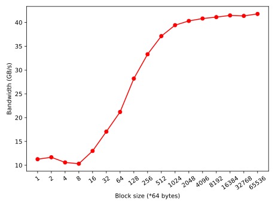
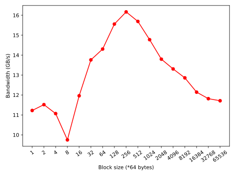

# **Data oriented design**

<!-- _paginate: skip  -->
<!-- _class: titlecover -->
<!-- _footer: "" -->


#### Peter Kardos


---

# Why care about memory layout?

| Year         | Processor| Cores | Memory | GFLOPS | Bandwidth | Ratio |
|--------------|-----------|------------|--------------|-----------|------------|---|
| **1998** | Intel P2 Xeon 400| 1x 400 MHz | DDR-200 | 0.2 | 1.6 GBps | **0.125 FLOPS/Bps** |
| **2022** | AMD Ryzen 9 7950X | 16x 5.0 GHz | DDR5-5200 | 1280 | 41.6 GBps | **30.77 FLOPS/Bps** |

In the past 25 years:
- Compute performance grew ~6000x
- Memory bandwidth only grew ~30x

Consequence:
- Applications can easily get memory bound
- Performant applications must use memory efficiently
- Efficient memory use requires careful design


---

# What is data-oriented design (DoD)?

- Think about your program as a graph of transforms
- Each transform takes some data as input and produces some other data
- Lay out your data in memory such that it's *efficient* to do the transforms


 

---


# Theory: memory hierarchy of modern systems

| Memory | Technology | Latency | Bandwidth | Price |
|--------------|-----------|------------|--------------|---|
| Registers | SRAM | < 1 cycle | - | $$$ |
| L1 cache | SRAM | 4 cycles | 1 TB/s | $$$ |
| L2 cache | SRAM | 16 cycles | 1 TB/s | $$$ |
| L3 cache | SRAM | 160 cycles | 400 GB/s | $$$ |
| DDR5 SDRAM | DRAM | 320 cycles | 40 GB/s | $$ |
| SSD | NAND flash | > 4000 cycles | 7 GB/s | $ |

- Many levels of storage until data reaches the CPU
- Want to keep "hot" data in fast storage
- Want to exploit strengths of storage technology

---

# Theory: operation of DRAM

- The organization and operation of DDR SDRAM is quite complex, we'll have a simplified view
- Reading procedure:
    1. Select the address you want to read
    2. Wait until the DRAM serves you the data - this can take a while
    3. Read out requested data (32, 64 or 128 bits at once)
    4. Read the next address:
        - Reading from nearby locations is quick
        - If reading from elsewhere you have to wait again until you get the data
- Burst mode:
    - You would normally get 64 bits of data
    - The DRAM can give you 8 consecutive blocks of 64 bits too
    - You don't need to wait between the 8 data packets, they come quickly after each other
    - That makes a chunks of 8x 64 bits == 64 bytes (remember that number!)
- Pretty much the same goes for writes

---

# Lesson #1: buy one, get 64 (1)

How to **use DRAM poorly**:
- Let's take a huge array of `int64`s and sum every 8th element
- This uses the first 8 bytes of a 64 byte burst

```c++
int64_t sum_every_8th(std::span<int64_t> values) {
    int64_t sum = 0;
    for (size_t idx = 0; idx < (values.size() & ~7u); idx += 8) {
        // Pick first element out of a block of 8.
        sum += values[idx + 0];
    }
    return sum;
}
```

**TODO: add illustration**

---

# Lesson #1: buy one, get 64 (2)

How to **use DRAM well**:
- Let's take a huge array of `int64`s and sum all elements
- This uses all 64 bytes of a 64 byte burst

```c++
int64_t sum_all(std::span<int64_t> values) {
    int64_t sum = 0;
    for (size_t idx = 0; idx < (values.size() & ~7u); idx += 8) {
        // Pairwise sum of all elements in a block of 8.
        sum += ((values[idx + 0] + values[idx + 1])
                + (values[idx + 2] + values[idx + 3]))
               + ((values[idx + 4] + values[idx + 5])
                  + (values[idx + 6] + values[idx + 7]));
    }
    return sum;
}
```

**TODO: add illustration**

---

# Lesson #1: buy one, get 64 (3)

**Question: how does the execution time of the two algorithms compare?** You can assume they both get the same input.
- (a) **Every 8th element faster**
- (b) **Equal**
- (c) **All elements faster**

**Make your bets!**

---

# Lesson #1: buy one, get 64 (4)

Results on my system:
```
sum all:       1130 ms, 37.9886  GiB/s
sum every 8th:  937 ms,  5.72767 GiB/s
```

*The theoretical maximum bandwidth of my computer is 53.6 GiB/s, so the benchmark was really (mostly) memory bound.*

**Answer: they run in (essentially) equal time.** We've requested 8 bytes, but we got 64 for free. The arithmetic we did on the free bytes was mostly hidden.

**Takeaway**: look at your calculation (*transform*), group together all data it uses, put data it doesn't use elsewhere. **You can't read a single byte from DRAM, you always read at least 64 bytes!**

**Note**: the tests eliminate the effect of CPU caching and prefetching as much as possible.

---

# Lesson #2: reads vs. block size (1)

Test method:
- Allocate a huge chunk of memory
- Split it into blocks of equal size
- Read bursts from each block, then change the block
    - We can read a block from start to end, linearly
    - We can randomly permute the accesses [start, end)
- No address is read twice all throughout -- we measure pure DRAM, not cache
- Explicitly prefetch addresses (explained later) -- we measure DRAM, not HW prefetcher

**TODO: Illustration of memory region split into blocks + accesses**

---

# Lesson #2: reads vs. block size (2)


<div class="twocolumns">
<div>

## Sequential access

 

</div>
<div>

## Randomized access

 

</div>
</div>

---

# Lesson #2: reads vs. block size (3)

- Sequential access is much faster (40 GB/s) than randomized access (16 GB/s)
- Sequential access:
    - The larger the block size, the better the bandwidth
- Randomized access:
    - Small and large block sizes are equally slow, the sweet spot is at 256*64 bytes
    - Explanation: DRAM is organized in rows and columns, and while changing a column is cheap, changing a row is expensive. The sweet spot corresponds to the fewest row changes, which likely explains the performance increase there.

**Question**: if column changes should have a very small cost, why does randomized access not peak at 40 GB/s? *The answer is left as an exercise to the reader.*

**Takeaway**: randomized access to the DRAM appears to be 3-4 times slower than sequential access, make sure to access memory in regular patterns and large contiguous blocks.

**Note**: the tests eliminate the effect of CPU caching and prefetching as much as possible.

---

# Theory: CPU cache hierarchy

Modern CPUs typically emply 3 levels of caching:
| Memory | Typical size | Count | Description |
|--------------|------|-----|------------|
| Registers | 64 bit | Many per core | The CPU can readily do arithmetic & logic only on registers. |
| **L1 cache** | ~64 kB | 1 per core | Small, ultra-fast memory, each CPU core has a dedicated instance. |
| **L2 cache** | ~1 MB | 1 per core | Very fast memory, each CPU core has a dedicated instance. |
| **L3 cache** | ~32 MB | 1 per package | Fast memory, this one is shared accross all CPU cores. |
| DRAM | 32 GB | 1-4 channels |  |

---

# Theory: cached memory reads

<div class="twocolumns">
<div>

**Goal**: bring 1 byte from DRAM into a register

**Procedure**:
1. Check if data is in L1 cache
2. Check if data is in L2 cache
3. Check if data is in L3 cache
4. Get data from DRAM
5. Insert data into L3 cache (+ address & metadata)
6. Insert data into L2 cache
7. Insert data into L1 cache
8. Write data into register

**Making space** : old data will be removed from the cache so that new can be inserted

</div>
<div>

**Cache hit**:
- If the data is found in any of the L1-L3 caches, we have a *cache hit*
- In that case, data is retrieved from there and written into the register, and the procedure terminates

**Cache miss**:
- If data is *NOT* found in the L? cache, we talk about an *L? cache miss*
- In that case, the procedure continues by checking the next cache level

</div>
</div>

---

# Theory: cached memory writes

<div class="twocolumns">
<div>

**Goal**: move 1 byte from register to DRAM

**Procedure**:
1. Read data from register
2. Insert data into L1 cache
</div>
<div>

**When is data actually written into DRAM?**
- Each piece of data written to L1 like this is flagged as *updated*
- When space in L1 is reclaimed, *updated* data gets written back to L2
- When space in L2 is reclaimed, the data again gets written back to L3 and then finally the DRAM

</div>
</div>

---

# Theory: cache entries

<div class="twocolumns">
<div>

**Cache lines**:
- Data in the caches is organized into so-called *cache lines*
- A cache line is typically 64 bytes (same as DRAM burst length, but could be different)
- Each cache entry stores
  - The data of the cache line
  - The memory address of the data
  - Information about the data (e.g. valid, updated, etc.)

</div>
<div>

**Replacement policies**:
- Once the cache is full, we cannot put more entries
- We must remove some entries to free up space
- Which entry should we remove?
  - Many strategies
  - Most practical is the *least recently used (LRU)* algorithm, or some variations of it

</div>
</div>

---

# Theory: cache coherence

**Problem**: CPU #1 and #2 write, while #3 reads the same memory location simultaneously. What happens?

**Solution**: memory accesses are serialized internally by the CPU, regardless of the initiating core:
1. CPU #1 writes data into its own L1 cache and invalidates this address in all other caches
2. CPU #2 writes data into its own L1 cache and invalidates this address in all other caches
3. CPU #3 reads address that is cached in CPU #2's L1 cache
    - The data is then flushed to the shared L3 cache
    - CPU #3 retrieves the data from the L3 cache

**Practical implementations**: there are different methods to implement cache coherence in modern, multi-core CPUs. We will not examine exact implementations, as it's not strictly necessary to understand the main principles.

---

# Lesson #3: keep frequently accessed data in caches


---

# References

- https://www.techpowerup.com/cpu-specs/pentium-ii-xeon-400.c2962
- https://www.amd.com/en/product/12151
- https://en.wikipedia.org/wiki/DDR_SDRAM
- https://en.wikipedia.org/wiki/DDR5_SDRAM
- https://www.agner.org/optimize/instruction_tables.pdf
- https://www.intel.com/content/www/us/en/developer/articles/technical/memory-performance-in-a-nutshell.html
- https://compas.cs.stonybrook.edu/~nhonarmand/courses/sp15/cse502/res/dramop.pdf


---

# END OF PRESENTATION

---

# How to write slides
Split pages by horizontal ruler (`---`). It's very simple! :satisfied:

```markdown
# Slide 1

foobar

---

# Slide 2

foobar
```

---

# A Slide with two columns

<div class="twocolumns">
<div>

## Code

```c++
void f(int x) {
}
```

</div>
<div>

## Explanations

declaration of a function f...

</div>
</div>

---

# Testing Math

Writing an expression here:  $ax^2+bx+c$

$$ I_{xx}=\int\int_Ry^2f(x,y)\cdot{}dydx $$

$$
f(x) = \int_{-\infty}^\infty
    \hat f(\xi)\,e^{2 \pi i \xi x}
    \,d\xi
$$
