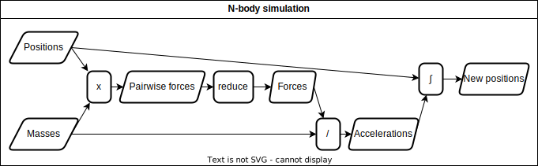

# **Data oriented design**

<!-- _paginate: skip  -->
<!-- _class: titlecover -->
<!-- _footer: "" -->


#### Peter Kardos


---

# Why care about memory layout?

| Year         | Processor| Cores | Memory | GFLOPS | Bandwidth | Ratio |
|--------------|-----------|------------|--------------|-----------|------------|---|
| **1998** | Intel P2 Xeon 400| 1x 400 MHz | DDR-200 | 0.2 | 1.6 GBps | **0.125 FLOPS/Bps** |
| **2022** | AMD Ryzen 9 7950X | 16x 5.0 GHz | DDR5-5200 | 1280 | 41.6 GBps | **30.77 FLOPS/Bps** |

In the past 25 years:
- Compute performance grew ~6000x
- Memory bandwidth only grew ~30x

Consequence:
- Applications can easily get memory bound
- Performant application must use memory efficiently


---

# What is data-oriented design (DoD)?

- Think about your program as a graph of transforms
- Each transform takes some data as input and produces some other data
- Lay out your data in memory such that it's *efficient* to do the transforms


 

---


# Modern systems: memory hierarchy

| Memory | Technology | Latency | Bandwidth | Price |
|--------------|-----------|------------|--------------|---|
| Registers | SRAM | < 1 cycle | - | $$$ |
| L1 cache | SRAM | 4 cycles | 1 TB/s | $$$ |
| L2 cache | SRAM | 16 cycles | 1 TB/s | $$$ |
| L3 cache | SRAM | 160 cycles | 400 GB/s | $$$ |
| DDR5 SDRAM | DRAM | 320 cycles | 40 GB/s | $$ |
| SSD | NAND flash | > 4000 cycles | 7 GB/s | $ |

- Many levels of storage until data reaches the CPU
- Want to keep "hot" data in fast storage
- Want to exploit strengths of storage technology

---

# References

- https://www.techpowerup.com/cpu-specs/pentium-ii-xeon-400.c2962
- https://www.amd.com/en/product/12151
- https://en.wikipedia.org/wiki/DDR_SDRAM
- https://en.wikipedia.org/wiki/DDR5_SDRAM
- https://www.agner.org/optimize/instruction_tables.pdf
- https://www.intel.com/content/www/us/en/developer/articles/technical/memory-performance-in-a-nutshell.html


---

# END OF PRESENTATION

---

# How to write slides
Split pages by horizontal ruler (`---`). It's very simple! :satisfied:

```markdown
# Slide 1

foobar

---

# Slide 2

foobar
```

---

# A Slide with two columns

<div class="twocolumns">
<div>

## Code

```c++
void f(int x) {
}
```

</div>
<div>

## Explanations

declaration of a function f...

</div>
</div>

---

# Testing Math

Writing an expression here:  $ax^2+bx+c$

$$ I_{xx}=\int\int_Ry^2f(x,y)\cdot{}dydx $$

$$
f(x) = \int_{-\infty}^\infty
    \hat f(\xi)\,e^{2 \pi i \xi x}
    \,d\xi
$$
