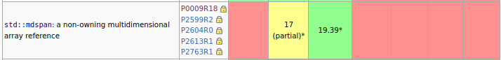
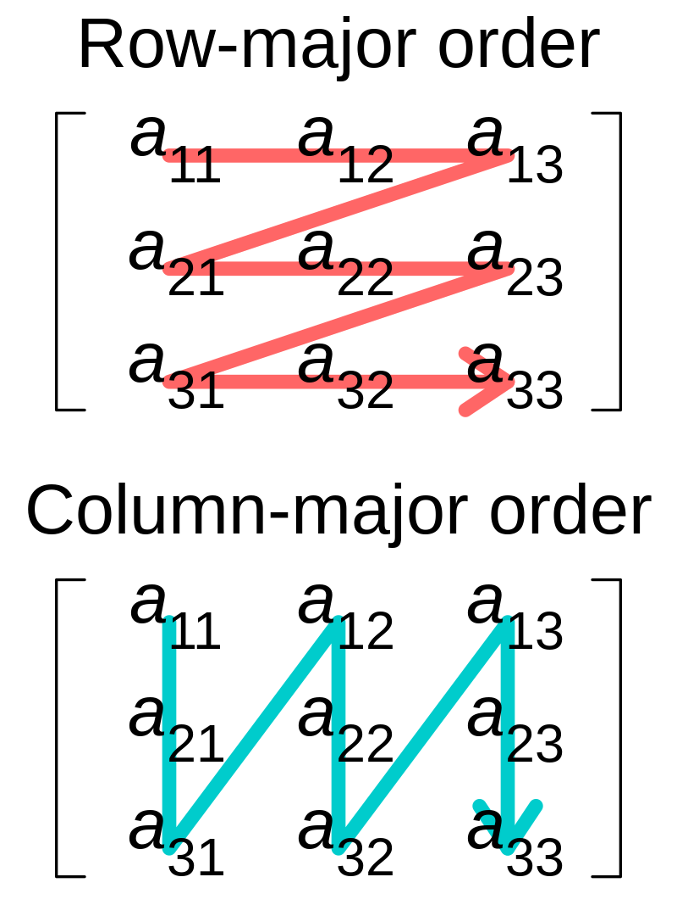

# Advanced C++ Course

<!-- _paginate: skip  -->
<!-- _class: titlecover -->
<!-- _footer: "" -->

### std::mdspan

#### CSCS

--- 

# Motivation

- C-Layout vs Fortran-Layout
- vocabulary type

HPC software dealing with multi-dimensional data:
- allocation of md array
- accessing md array
- iteration over md array

How to interface between libraries?
- Best case: well-defined/described concept that can be modelled by the *other* library
- Worst case: concrete class

---

# What is std::mdspan?

`std::mdspan ` is a non-owning multi-dimensional array view

- since C++23, see https://wg21.link/p0009 and  https://eel.is/c++draft/views#multidim

- think of *pointer* and *metadata* (how to interpret the pointed-to memory)

```c++
template<
    class T,
    class Extents,
    class LayoutPolicy = std::layout_right,
    class AccessorPolicy = std::default_accessor<T>
> class mdspan;
```

- *TriviallyCopyable*\*: can be used in host/device interfaces
- allows different layouts

\* under some costraints

---

# std::mdspan<...>

```c++
template<
    class T,
    class Extents,
    class LayoutPolicy = std::layout_right,
    class AccessorPolicy = std::default_accessor<T>
> class mdspan;
```
```c++
std::vector<float> v(100);
auto v_span = std::mdspan(v.data(), std::extents{ 10, 10 });
```

- `T` is the element type (`my_mdspan::element_type`): `float`
- `Extents` describes number of dimensions and there sizes (required to be spezialization of `std::extents`)
- `LayoutPolicy` describes memory layout (`my_mdspan::layout_type`): default `std::layout_right` (C-layout)
- `AccessorPolicy` allows customization how we access the data (`my_mdspan::accessor_type`):
  think `std::default_accessor<T>` does pointer dereference of `T*`

```c++
v_span[2, 3] = 42.;
```
---

# std::extents

- can describe run-time and compile-time extents
- compile-time extents are helpful for optimizations (explicit by library implementor or implicit by compiler)

- very easy (thanks to CTAD): `std::extents{ 10, 10 }`

```c++
template< class IndexType, std::size_t... Extents >
class extents;
```

- `IndexType` is a signed or unsigned integer type
- each element of `Extents` is either
  - `std::dynamic_extent` or 
  - representable as value of `IndexType` (compile-time extents)

---

# std::extents

## Examples

```c++
auto ext1 = std::extents<int, std::dynamic_extent, 3, std::dynamic_extent, 4>{ 42, 43 };
static_assert(decltype(ext1)::rank() == 4);
static_assert(decltype(ext1)::rank_dynamic() == 2);
static_assert(decltype(ext1)::static_extent(0) == std::dynamic_extent);
assert(ext1.extent(0) == 42);
static_assert(decltype(ext1)::static_extent(1) == 3);
static_assert(std::extent_v<decltype(ext1), 2> == 3);
```

```c++
auto ext2 = std::extents<std::uint8_t, 3, 4>{};
static_assert(decltype(ext2)::static_extent(0) == 3);
static_assert(decltype(ext2)::static_extent(1) == 4);
```

```c++
auto ext3 = std::extents{ 42, 44 };
static_assert(decltype(ext3)::static_extent(42) == std::dynamic_extent);
assert(ext3.extent(0) == 42);
```

```c++
auto ext4 = std::dextents<int, 3>{ 42, 43, 44 };
```

---

# LayoutPolicy

<div class="twocolumns">
<div>

- provided policies:
  - `std::layout_right` (default, row-major, C-layout)
  - `std::layout_left` (column-major, Fortran-layout)
  - `std::layout_stride` generalization for arbitrary strides
- custom layout:
  - skip elements (e.g. tiling)
  - multiple indices to one same element
</div>
<div>


https://commons.wikimedia.org/wiki/User:Cmglee, CC BY-SA 4.0
</div>
</div>


```c++
using strided_md_span = std::mdspan<float, std::dextents<std::size_t, 3>, std::layout_stride>;
auto s = strided_md_span(some_ptr, { std::dextents<std::size_t, 3>(2, 5, 10), std::array<std::size_t, 3>{ 5, 1, 10 } });

assert((some_ptr[2 + 5 + 30] == s[1, 2, 3]));
```


---

# Layout example*

```c++
using layout = /* see-below */;

std::mdspan<double, std::extents<int, N, M>, layout> A = ...;
std::mdspan<double, std::extents<int, N>> y = ...;
std::mdspan<double, std::extents<int, M>> x = ...;

std::ranges::iota_view range{0, N};

std::for_each(std::execution::par_unseq, 
  std::ranges::begin(range), std::ranges::end(range),
  [=](int i) {
     double sum = 0.0;
     for(int j = 0; j < M; ++j) {
       sum += A[i, j] * x[j];
     }
     y[i] = sum;
  });
```

- on CPUs: C-layout aka row-major aka std::layout_right performs well (vectorized inner loop)
- on GPUs: Fortran-layout aka column-major aka std::layout_left performs well (coalesced memory load)

\* from https://www.open-std.org/jtc1/sc22/wg21/docs/papers/2022/p0009r18.html 2.6

---

# AccessorPolicy

## Example

```c++
template <class ElementType>
struct default_accessor {
  using offset_policy = default_accessor;
  using element_type = ElementType;
  using reference = ElementType&;
  using data_handle_type = ElementType*;

  // some ctors

  constexpr data_handle_type offset(data_handle_type p, size_t i) const noexcept {
    return p + i;
  }

  constexpr reference access(data_handle_type p, size_t i) const noexcept {
    return p[i];
  }
};
```

---
# Custom Accessor Example: protect host/device access

```c++
template <class ElementType, DeviceType Device>
struct host_device_protector {
    using offset_policy = host_device_protector; using element_type = ElementType;
    using reference = ElementType&; using data_handle_type = ElementType*;

    constexpr data_handle_type offset(data_handle_type p, size_t i) const noexcept { return p + i; }

    constexpr reference access(data_handle_type p, size_t i) const noexcept {
#ifdef __CUDA_ARCH__
        static_assert(Device == DeviceType::CUDA);
#else
        static_assert(Device == DeviceType::CPU);
#endif
        return p[i];
    }
};
```
```c++
void test_host_device_protector() {
    float* dev_ptr = allocate_some_cuda_memory<float>(4);
    auto s = std::mdspan<float, std::dextents<int, 2>, std::layout_right, host_device_protector<float, DeviceType::CPU>>{ dev_ptr, std::dextents<int, 2>{ 2, 2 } };
    std::cout << s[1, 2] << std::endl;
}
```

```bash
> error: static assertion failed due to requirement '(DeviceType)1 == DeviceType::CPU'
```

---

# submdspan

- not part of C++23, but in working draft for C++26, see https://wg21.link/p2630 and https://eel.is/c++draft/mdspan.submdspan

---

# Example: mdspan from custom mdarray\*


\* std::mdarray is proposed in https://wg21.link/p1684

---
# Questions?

<!-- _paginate: skip  -->
<!-- _class: titlecover -->
<!-- _footer: "" -->
